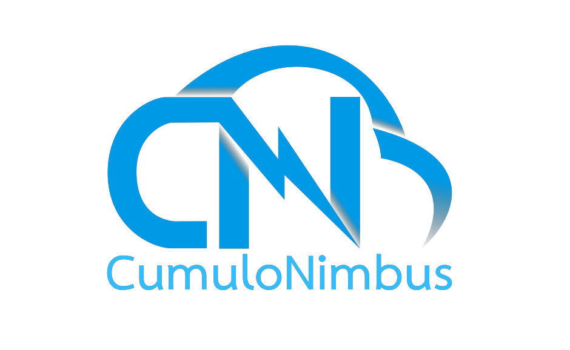

# Inteli - Instituto de Tecnologia e Liderança 

# Desenvolvimento de serviços em cloud computing

## Cumulonimbus

### Integrantes: <a href="https://www.linkedin.com/in/beatriz-hirasaki-leite-b2261923a/">Beatriz Hirasaki</a>, <a href="https://www.linkedin.com/in/felipe-gomes-526186232/">Felipe Gomes</a>, <a href="https://www.linkedin.com/in/gabrielriostorres/">Gabriel Rios</a>, <a href="https://www.linkedin.com/in/mateus-neves-3b767123b/">Mateus Neves</a>, <a href="https://www.linkedin.com/in/mike-mouadeb-24b781224/">Mike Mouadeb</a>, <a href="https://www.linkedin.com/in/priscila-falc%C3%A3o-3435a1244/">Priscila Falcão</a> e <a href="https://www.linkedin.com/in/wagner-estevam/">Wagner Estevam</a>. 

## Descrição

### 💻 Projeto
  
O projeto é uma aplicação web em cloud, baseado na arquitetura de 3 camadas, contendo: front-end, back-end e banco de dados hospedados na AWS.
  

➕ MAIS SOBRE
  
Muitos profissionais de T.I se interessam por aprender novas tecnologias. Por exemplo, uma pessoa que trabalha com Front-end usando JavaScript quer aprender Ciência de Dados e programar em Python. Assim, pôde se observar essa demanda na Dell, onde alguns profissionais estão saindo da empresa por não estarem se sentindo desafiados e não estarem tendo oportunidades de ganhar novos conhecimentos. Isso tem gerado preocupação para a empresa que busca novos mecanismos para a permanência de deus colaboradores.
  
Neste sentido, com o objetivo de manter o engajamento de seus funcionários, o grupo Cumulonimbus desenvolveu uma aplicação web em nuvem, a fim de centralizar e conectar essa demanda dos funcionários de adquirirem novos conhecimentos com a oferta de projetos temporários que há na companhia. Com a segurança e escalabilidade que os serviços em nuvem oferecem, o projeto conta com a estrutura da AWS para desenvolver as suas diferentes camadas da aplicação.
  

## 💾 Estrutura de pastas

-Raiz 
| 
|-->docs 
|-->documentos 
  &emsp;|-->antigos 
  &emsp;|GDD.docx ou Documentação.docx 
|-->executáveis 
  &emsp;|-->windows 
  &emsp;|-->android 
  &emsp;|-->HTML 
|-->imagens 
|-->src 
|readme.md 

## 🛠 Instalação

1 -
2 - 
3 - 

## 💻 Configuração para Desenvolvimento

1 - 
2 - 
3 - 
4 - 

## 📄 Histórico de lançamentos

A cada atualização os detalhes devem ser lançados aqui.

* Sprint 1 - 10/02/2023
    * Wireframe
    * Arquitetura do sistema V1
    * Matriz SWOT
    * Value Proposition Canvas 
    * Diagrama de sequência do fluxo de dados
    * 5 Forças de Potter
    * Matriz de risco
    * Casos de uso
    * Especificação dos requisitos
* Sprint 2 - 24/02/2023
    * Desenvolvimento GitFlow
    * Definição da arquitetura de pastas
    * Produção de VPCs e subredes
    * Produção de instâncias na EC2
    * Produção de buckets no S3
    * Modelo lógico de dados
    * Modelo conceitual de dados
    * Endpoints TDD
    * Arquitetura da solução V2
    * Adaptação do wireframe para os requistos do cliente
* Sprint 3 - 10/03/2023
    * Back-end com enpoints funcionais
    * Documentação API
    * Front-end em React
    * Arquitetura da solução V3
    * Produção de banco de dados no RDS
* Sprint 4 - 24/03/2023
    * 
    * 
* Sprint 5 - 07/04/2023
    * 
    *
    *

## 🎓 Referências

Aqui estão as referências usadas no projeto.

1. <https://github.com/iuricode/readme-template>
2. <https://github.com/gabrieldejesus/readme-model>
3. <https://creativecommons.org/share-your-work/>
4. <https://freesound.org/>
5. Músicas por: <a href="https://freesound.org/people/DaveJf/sounds/616544/"> DaveJf </a> e <a href="https://freesound.org/people/DRFX/sounds/338986/"> DRFX </a> ambas com Licença CC 0.
